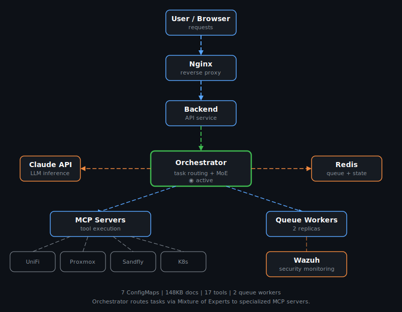

# Cortex K3s

**Kubernetes cluster documentation — deployment architecture, security, and monitoring.**

> :warning: **This project is archived.** No longer under active development.

---

## Overview

Documentation for the Cortex K3s cluster, including Wazuh security platform deployment, KEDA autoscaling configuration, and monitoring stack setup. All docs extracted from live ConfigMaps.

## Architecture

## Documentation Index

| Document | Size | Description |
|----------|------|-------------|
| 8-Hour Exploration Summary | 25KB | Executive summary of infrastructure discovery |
| Integration Guide | 32KB | Master reference connecting all components |
| Workflows | 18KB | Real workflow documentation |
| Tools Catalog | 14KB | Complete catalog of 17 tools |
| LLM-D Architecture | 9.6KB | LLM Daemon / Orchestrator design |
| Task Processing | 22KB | Queue and worker processing |
| MoE Routing | 28KB | Mixture of Experts routing system |

## Key Components

- **Orchestrator** — routes tasks to specialized MCP servers
- **Queue Workers** — 2 replicas for parallel processing
- **Redis** — message queue and session state
- **MCP Servers** — tool execution (UniFi, Proxmox, Sandfly, K8s)
- **Wazuh** — security monitoring and threat detection

## Stats

- 7 ConfigMaps, 148KB total documentation
- 17 tools across multiple MCP servers
- End-to-end workflow verification

---

Built with Claude. No longer maintained.

