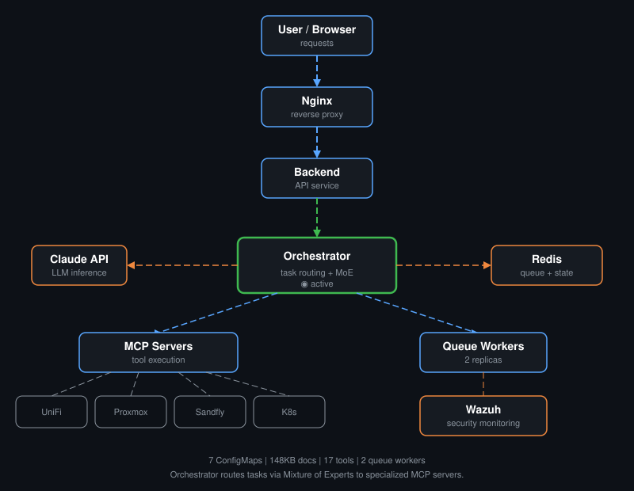

> [!NOTE]
> **Archived.** This repo is part of [Cortex](https://github.com/cortex-io), which is no longer under active development. It is kept as a working record: explore, fork and borrow freely, but no fixes or features are planned.

<a href="https://github.com/cortex-io"><b>Cortex</b></a> &nbsp;·&nbsp; <a href="https://github.com/cortex-io/cortex">cortex</a> · <a href="https://github.com/cortex-io/cortex-platform">cortex-platform</a> · <a href="https://github.com/cortex-io/cortex-gitops">cortex-gitops</a> · <b>cortex-k3s</b> · <a href="https://github.com/cortex-io/cortex-docs">cortex-docs</a> · <a href="https://github.com/cortex-io/cortex-construction-hq">cortex-construction-hq</a> · <a href="https://github.com/cortex-io/infrastructure-docs">infrastructure-docs</a>

## What's here

Documentation for the Cortex K3s cluster (Wazuh security, KEDA autoscaling, the monitoring stack), plus the deployment manifests, coordination state and scripts behind it. The core docs were extracted from the live cluster's ConfigMaps.

## Key components

- **Orchestrator:** routes tasks to specialized MCP servers using Mixture-of-Experts routing
- **Queue workers:** 2 replicas for parallel processing
- **Redis:** message queue and session state
- **MCP servers:** tool execution for UniFi, Proxmox, Sandfly and Kubernetes
- **Wazuh:** security monitoring and threat detection

## The ConfigMap docs

| Document | Size | What it covers |
|---|--:|---|
| [8-hour exploration summary](configmaps/8-hour-exploration-summary-backup.yaml) | 25 KB | Executive summary of the infrastructure discovery |
| [Integration guide](configmaps/cortex-integration-guide-backup.yaml) | 32 KB | Master reference connecting all components |
| [Workflows](configmaps/cortex-workflows-backup.yaml) | 18 KB | Real workflow documentation |
| [Tools catalog](configmaps/cortex-tools-catalog-backup.yaml) | 14 KB | All 17 tools |
| [LLM-D architecture](configmaps/llm-d-architecture-backup.yaml) | 9.6 KB | The LLM daemon / orchestrator design |
| [Task processing](configmaps/cortex-task-processing-backup.yaml) | 22 KB | Queue and worker processing |
| [MoE routing](configmaps/cortex-moe-routing-backup.yaml) | 28 KB | The Mixture-of-Experts routing system |

More in [ARCHITECTURE.md](ARCHITECTURE.md), [CORE-PRINCIPLES.md](CORE-PRINCIPLES.md) and [README-K3S.md](README-K3S.md).

## By the numbers

7 ConfigMaps · 148 KB of documentation · 17 tools across the MCP servers · end-to-end workflow verification

---

Part of the <a href="https://github.com/cortex-io">Cortex archive</a> · built with Claude

